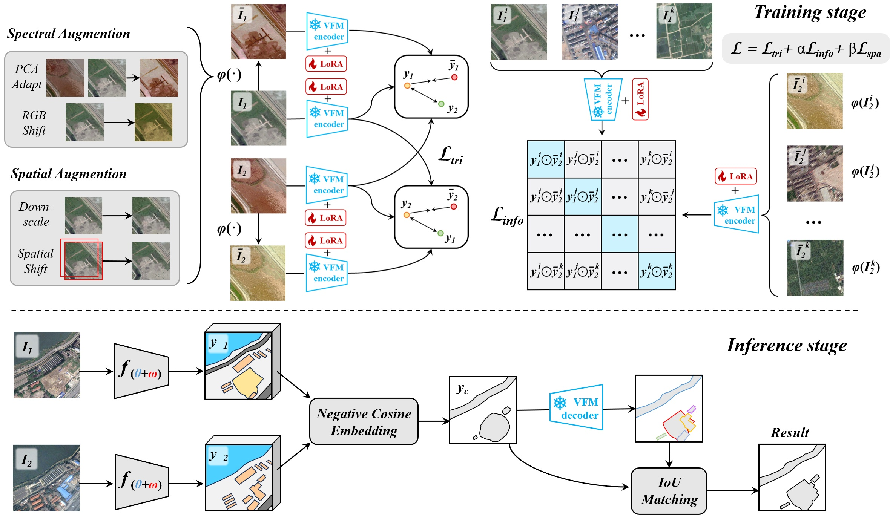

# S2C: A Noise-Resistant Difference Learning Framework for Unsupervised Change Detection in VHR Remote Sensing Images

This repository contains the official implementation of **S2C (Semantic-to-Change)**,  
an unsupervised change detection framework designed for **very high resolution (VHR) remote sensing images**.



Our paper has been **accepted by AAAI 2026**.

> **Paper title**:  
> *S2C: A Noise-Resistant Difference Learning Framework for Unsupervised Change Detection in VHR Remote Sensing Images*  
> **Venue**: AAAI Conference on Artificial Intelligence (AAAI-26)

## Method Overview

S2C is a contrastive learning based framework that:

- **Learns noise-resistant differences** instead of only temporal similarity;
- Uses a **multi-temporal triplet learning strategy** to explicitly model temporal changes;
- Introduces **random spatial and spectral perturbations** to enhance robustness to temporal noise;
- Introduces **grid sparsity regularization** to suppress insignificant changes;
- Uses an **IoU-matching refinement** module to further clean up change maps.

## Accuracy and Benchmark Results

S2C is evaluated on **three VHR change detection benchmarks**, and achieves:

- **+31%**, **+9%**, and **+23%** relative improvements over previous state-of-the-art methods  
  (in terms of standard change detection metrics on the three benchmarks).

These gains demonstrate that S2C is:

- **More accurate** in locating real changes under severe spectral and spatial variations;  
- **More robust and sample-efficient**, suitable for training and adapting various visual foundation models (VFMs) or backbone networks.

More detailed results and analyses can be found in the paper and its arXiv version.

## Citation

If you find this work useful in your research, please consider citing:

```text
@article{ding2025s2c,
  title={S2C: Learning Noise-Resistant Differences for Unsupervised Change Detection in Multimodal Remote Sensing Images},
  author={Ding, Lei and Zuo, Xibing and Hong, Danfeng and Guo, Haitao and Lu, Jun and Gong, Zhihui and Bruzzone, Lorenzo},
  journal={arXiv preprint arXiv:2502.12604},
  year={2025}
}
```

## Code Availability

**All codes will be re-organized, standardized, and then released (COMING SOON).**


